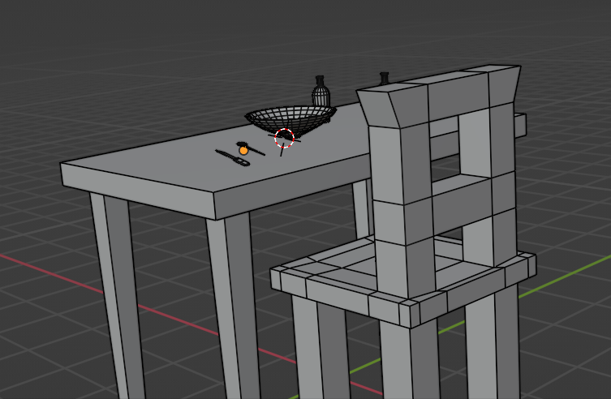
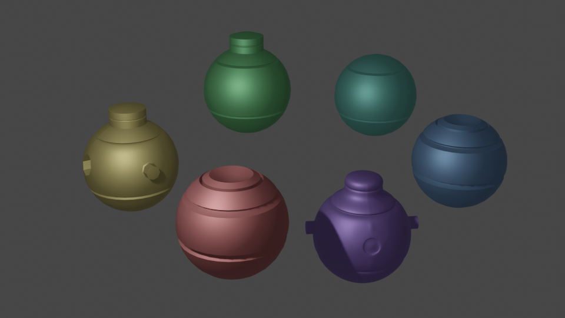

# learn blender

Video resources:

- [The BEST Way To Learn Blender in 2023!!](https://www.youtube.com/watch?v=8K4AShjq-MU) by [Ducky 3D][d3]
- [Get Good @ Blender](https://www.youtube.com/playlist?list=PLn3ukorJv4vvv3ZpWJYvV5Tmvo7ISO-NN) by [Grant Abbitt][grabbitt]
- [Donut Tutorial](https://www.blenderguru.com/tutorials/2022/1/27/how-to-use-blender) by [Blender Guru](https://www.blenderguru.com)
- [Nodes 4 Noobs](https://www.youtube.com/playlist?list=PLn3ukorJv4vtnU_TaZob7QD6Q8d9C9Ki7) by [Grant Abbitt][grabbitt]

## Notes

Each tutorials takes between 10 to 20 minutes. Let's get started!

### General tips

- Edit -> Preference -> Interface -> Line Width: **thick**
- Camera properties -> Viewport Display -> Composition Guide -> **thirds**, **diagonals**, ...
- <kbd>shift</kbd><kbd>c</kbd>: put cursor in the center

### Node wrangler addon

- <kbd>ctrl</kbd><kbd>t</kbd>: plug texture coordinate
- <kbd>ctrl</kbd><kbd>shift</kbd><kbd>left-click</kbd>: preview node
- drag <kbd>ctrl</kbd><kbd>shift</kbd><kbd>right-click</kbd>: mix two nodes

### Donut Tutorial - Part 1 - The basics

Learn how to move around and select things.

- <kbd>~</kbd>: bring menu to focus on object.

### Get Good @ Blender - Part 1 - Beginner Exercises

Learn the edit mode:

- <kbd>ctrl</kbd><kbd>g</kbd>: loop cut
- <kbd>e</kbd>: extrude
- <kbd>i</kbd>: inset face

### Donut Tutorial - Part 6/7 - Rendering/Texturing

Learn the shader node:

- Principled BSDF, based on the Disney PBR shader
- Noise texture + color ramp
- Bump normal

### Get Good @ Blender - Part 2 - Beginner Exercises

Learn modifier. In object mode:

- <kbd>shift</kbd><kbd>h</kbd>: hide all but selected, use <kbd>alt</kbd> for inverse.
- <kbd>n</kbd>: show item
- <kbd>ctrl</kbd><kbd>a</kbd>: apply transformation/scaling

In edit mode:

- <kbd>c</kbd>: circle select
- <kbd>alt</kbd><kbd>e</kbd>: extrude individual

### Get Good @ Blender - Part 3 - Low Poly Weapons

In edit mode:

- Select menu: select more
- Addon: auto mirror tool, available in edit on the left
- <kbd>g</kbd><kbd>g</kbd>: grab along edge
- <kbd>o</kbd>: proportional editing

### Get Good @ Blender - Part 4 - Low Poly Buildings

Learn about repeat modifier:

- <kbd>ctrl</kbd><kbd>j</kbd>: join objects
- Combine 3 array modifiers to repeat a wall pattern:

- <kbd>k</kbd>: cut tool
- <kbd>f</kbd>: make face

### Get Good @ Blender - Part 4 - Hard Surface Modelling 1

- Use *shade smooth*, in the Object data properties -> Normals -> **Auto Smooth**
- Addon: loop tools, and use by right-clicking on edges to create circle.

- Use *Subdivision Surface* modifier, and adjust loop cut to sharpen. That's called supporting edge loop, or proximity edge loop:

### Nodes 4 Noobs | Lvl 1

### Nodes 4 Noobs | Lvl 2

### Nodes 4 Noobs | Lvl 3

### [Blender 3D - Create a 3D Isometric BEDROOM](https://www.youtube.com/watch?v=yCHT23A6aJA)

### [10 Minute Tutorial - Build a Simple Network in Geometry Nodes (Blender Abstract tutorial)](https://www.youtube.com/watch?v=vcESjx01DdA) by [Ducky 3D][d3]

### [How To Get That Modern 3D Look in Blender](https://www.youtube.com/watch?v=eDTvDHIa7TE) by [Ducky 3D][d3]

In edit mode:

- <kbd>f3</kbd>: Mesh -> Separate -> By Loose Parts
- Then in object mode, <kbd>m</kbd>: move to new collection

- Glass material

- Light noise shader for cycles

- Result:

### [The Loop Hole #01 - Looping Smoke Simulations](https://www.youtube.com/watch?v=EJkX83giWlg) by [Midge Sinnaeve][mantissa.xyz]

# Backlog

- [Compositor Series](https://www.youtube.com/watch?v=M20P4tkNWLM&list=PLn3ukorJv4vvH9O2bE6I8c0rjcz3oot8G) by [Grant Abbitt][grabbitt]

## Photorealism

[grabbitt]: https://www.youtube.com/@grabbitt
[d3]: https://www.youtube.com/@TheDucky3D
[mantissa.xyz]: https://mantissa.xyz
