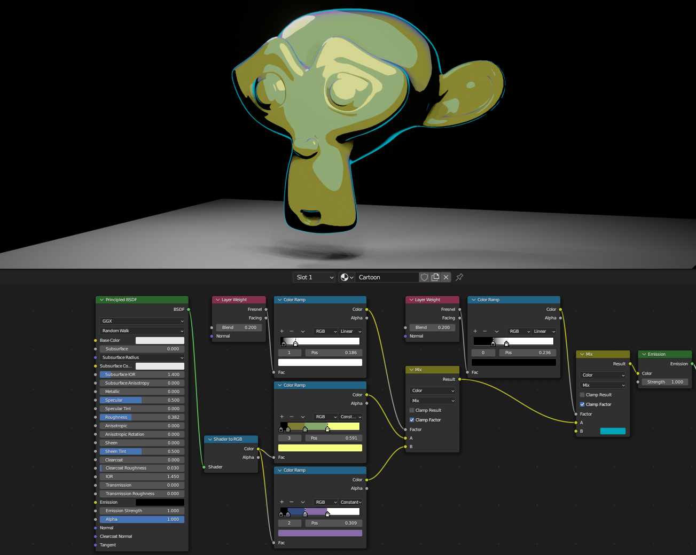
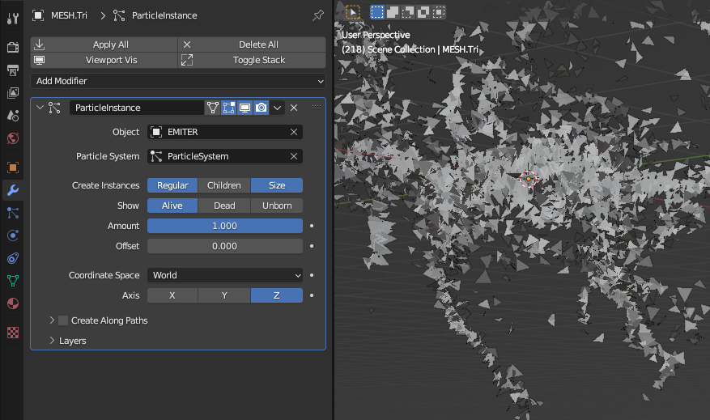

[Real Time Motion Graphics](https://blendermarket.com/products/rtmg)
====================================================================

# Shortcuts

## Viewport

- <kbd>shift</kbd><kbd>c</kbd>: move the cursor to the origin of the scene
- <kbd>shift</kbd><kbd>z</kbd>: toggle wireframe view

- <kbd>ctrl</kbd><kbd>alt</kbd><kbd>0</kbd>: move camera to match the current view

## Object mode

- <kbd>ctrl</kbd><kbd>a</kbd>: apply transformation/scaling

## Edit mode

- <kbd>ctrl</kbd><kbd>a</kbd>: changes the vertex radius (useful with skin modifier)

## Timeline

- <kbd>shift</kbd><kbd>left/right</kbd>: jump to begining/end

# Intro

## 1 - Setup

- Remove workspace from startup file
- Setup a three column views
- Disable viewport anti-aliasing
- Set animation default interpollation to linear

## 202 - Simple Cable

Create cable with:

- apply skin modifier to a single point
- extrude to shape the cable
- apply subdivide modifier to reduce control points
- apply displace modifier to adjust path location

## 203 - Modifier Coordinates

Create terrain:

- subdivide a plane
- apply displace modifier
- set displace texture to noise
- change texture coordinate to taste

## 501 - indirect lightning

- Lower light custom distance
- Add irradiance volume

- Adjust probes
- Bake the indirect light
- Display irradiance size to observe the effect

- Result:

# Second part

## 204 - Deforming Arrays

Create a rope procedurally.

- apply array modifier using an empty plane offset object
- rotate the plane offset to create the threads
- apply simple deform modifier for the twist effect
- apply curve modifier to follow a bezier path

- Result:

https://github.com/TristanCacqueray/learn-blender/assets/154392/b472fac8-2e4f-40af-8ea6-8f86c38dfacb

## 205 - Vertex Weights I

- apply vertex weight modifier using a texture or gradient
- apply displace modifier using the vertex group
- set vertex modifier texture coordinate to an empty plane
- apply vertex weight mix using subtract mix mode
- move, rotate and scale the empty plane

- try adding wireframe modifier
- Result:

https://github.com/TristanCacqueray/learn-blender/assets/154392/d6f757c8-626c-4abd-bb8d-ec35f140e3c7

## 206 - Vertex Weights II

- with loop tools, space vertex on a side
- set multiple vertex group and adjust weight using empty control cube

- Result:

## 208 - Masked Grid

- in uv editor, scale each point to 0

- apply mask modifier to remove vertices

- Result:

## 209 - Intricate Grid Pattern

- apply remesh modifier to merge overlapping displace:

## 210 - Organic Pattern

- apply decimate modifier with un-subdivide to change polygone's direction
- apply displace modifier with tiny strength texture to change decimate angle

- Result:

# Shading

## 404 - Shading randomness

- use object info random value:

- curved shader:

- Result:

https://github.com/TristanCacqueray/learn-blender/assets/154392/125c0bf2-f3bb-4cac-964c-47d4881f6b7c

## 406 - Vector Manipulation

- multiply object coordinate with a texture to distort another texture:

- Result:

https://github.com/TristanCacqueray/learn-blender/assets/154392/55cdb7c1-4379-42c5-9ee0-571f34f0ddc9

## 407 - Dust shader

- enable transparent BSDF in EEVE by switching blend mode to "Alpha Blend":

## 408 - Shader To RGB

- create cartoon shader using shader to RGB node:

## 303 - Looping Modifier

- scale the graph view by pressing <kbd>ctrl</kbd><kbd>middle click</kbd> and moving the cursor to adjust the xaxis and yaxis

- initialize sin modifier phase multiplier to `2*pi/frame_count` for seamless loop

- unlink animation data by search with <kbd>f3</kbd> `animation data` in object view and pick "Relations" -> "Make Singe User" -> Objet Data Animation

- Result:

https://github.com/TristanCacqueray/learn-blender/assets/154392/755cb912-190b-4f2a-8f97-2edd1c597ce2

- apply ocean modifier in displace mode. Set time driver to `#frame / 50`:

## 305 - Cloth cache

- export cloth simulation bake as pc2 (point cache)

- apply mesh cache modifier with frame offset for seamless loop

- Result:

https://github.com/TristanCacqueray/learn-blender/assets/154392/d2e7ede2-42fc-4da6-8be2-084352b1f392

## 306 - Hair cache

- loop two turbulences by key framing the strength

- export simulation as alembic for curves

- with curve geometry, add bevel/extrude, then export "as mesh" with alembic

- Result:

https://github.com/TristanCacqueray/learn-blender/assets/154392/5aab25cd-f1f7-4f56-8f67-63af101d2071

- animate the color ramp of the blend texture displace:

- Result:

https://github.com/TristanCacqueray/learn-blender/assets/154392/f04a4f33-dacb-47ae-a779-b711c0a85f8e

## 307 - Particule cache

- setup a particule system

- apply particule instance modifier to spawn a mesh

- add a particule simulation texture to modify the size

- export the mesh as alembic, and re-import twice using time offset for seamless loop

https://github.com/TristanCacqueray/learn-blender/assets/154392/ab2bee05-9cd5-4cdd-93e5-938841a47ce3

## 502 - Reflections

- add reflection plane light probe on a mirror surface

- add reflection cube map around smooth mesh

## 503/4 - Volumetrics

- modulate principled volume shader density with a noise texture

## 505 - Compositor

